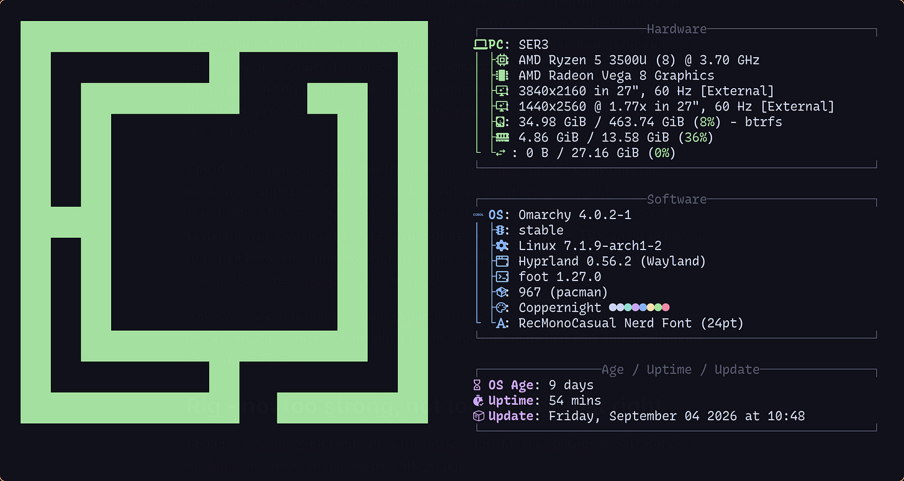
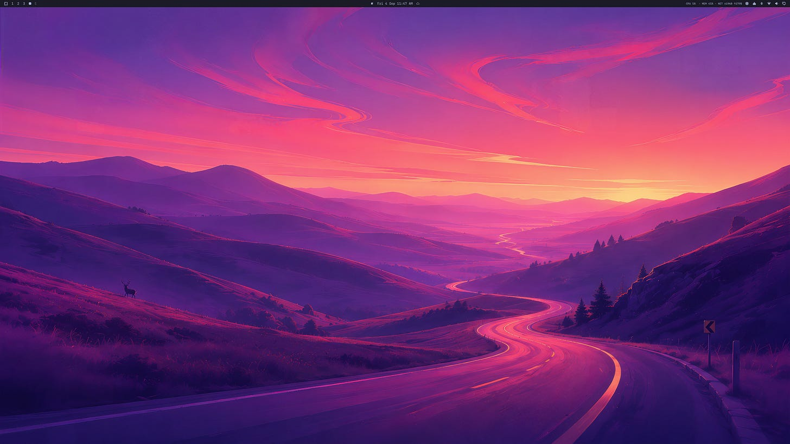
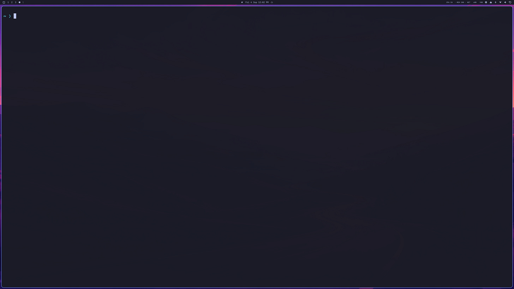
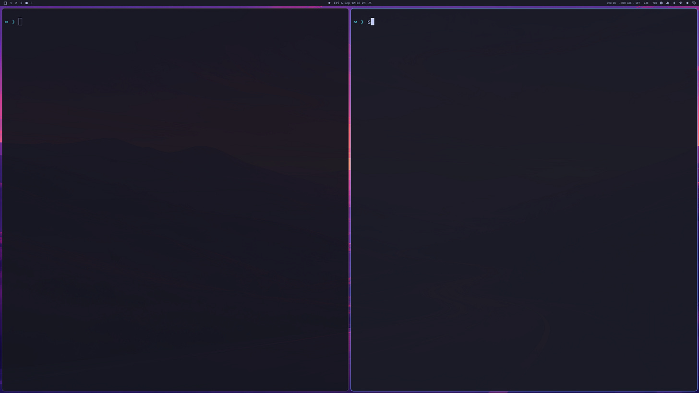
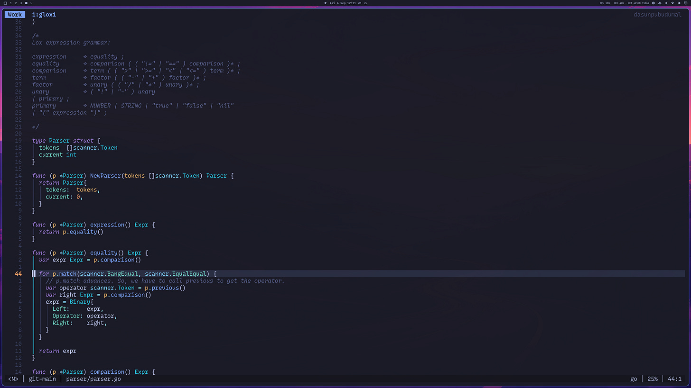
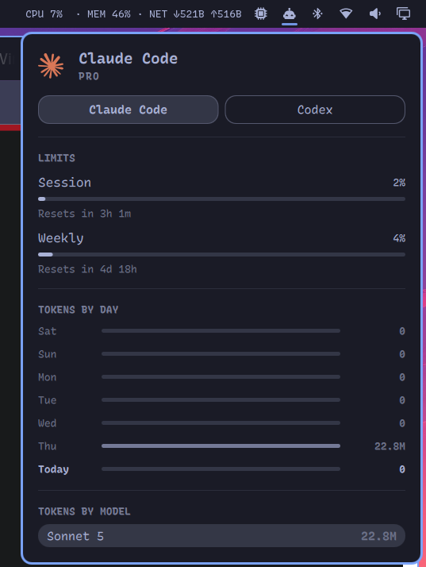
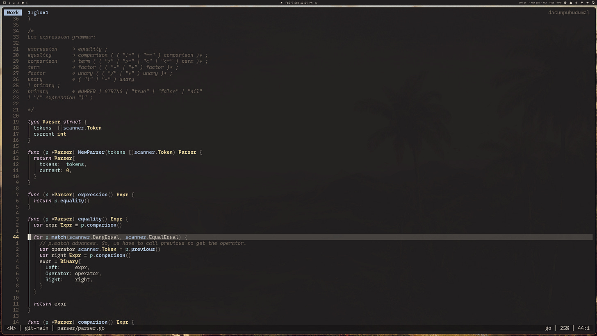
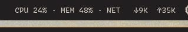

_Originally published on [my Substack](https://dasunpubudumal.substack.com/p/i-installed-omarchy) on 4 September 2026._

[Omarchy](https://omarchy.org/) has been getting quite a lot of attention over the past couple of weeks, with its new release of [Omarchy Quattro](https://github.com/omacom/omarchy/releases#release-v4.0.0). Backed by patrons each contributing $1 million, the [Omacom Foundation](https://omarchy.org/news/2026/08/omacom-foundation-launches-with-8-million/) has grown - at the time of this writing - up to $12.6 million. The Arch-based distribution looks quite nice; the OOTB (Out Of The Box) configuration feels smooth and lovely - especially for a developer like myself who loves terminal/text-based user interfaces ([TUIs](https://en.wikipedia.org/wiki/Text-based_user_interface)) and likes to invest time to have that “flow”-like development setup. Although I had to make some tweaks here and there, the first-look absolutely kept to the hype.

## Omarchy: for people looking for a “malleable computer of the future”

Omarchy was created by [DHH](https://dhh.dk/)[^1], the creator of Ruby on Rails. It’s safe to say that it’s highly opinionated - all the configuration in the `~/.config` that comes out of the box are tailored to some subjective tastes. It’s got all batteries included - Neovim[^2], tmux and the [Foot terminal](https://codeberg.org/dnkl/foot) for development, and many others applications wrapped in as web-apps (e.g., YouTube, Google Maps, X, etc).

The cherry on-top is [Hyperland](https://hypr.land/) and [Quickshell](https://quickshell.org/). Hyperland is the tiling manager - I think this is what dragged me into Omarchy in the first place (well, that and the configs). I use macOS for work, and I have installed [yabai](https://github.com/asmvik/yabai) as the tiling manager and absolutely love it. Yabai has to fight against the native macOS weirdness while Hyperland in Omarchy acts as the primary display server. Omarchy desktop runs as a single long-lived Quickshell process (called `omarchy-shell`). Various elements like the top bar and drop-downs are just plugged in into the process as plugins. Because of this, developers can create their own customised UI components and plug them into the desktop.

The ideal navigational workflow throughout Omarchy would be using only the keyboard[^3]. ++Super + K++ opens a window with all the shortcuts - and the content is searchable (which is a massive deal). Almost _all_ the navigation can be done via the keyboard. You switch workspaces with ++Super + \<Workspace ID\>++, and it helps you to switch between without weird fading and scrolling animations that some operating systems have (yes, macOS). It’s super quick.

Anyway, you can read more about [Omarchy](https://omarchy.org/) from the official docs. Following sections discuss my experiences on installing it, my thoughts on its first look and my thoughts on configuring it.

## Rig - not too strong, not too weak - just right

I bought a [Beelink SER3](https://www.amazon.co.uk/Beelink-SER5-Processors-Computer-Pre-installed/dp/B0DN9KWLPW) mini PC with 16GB of RAM, and 500GB of SSD storage as my linux box; it’s running a `x86_64` AMD Ryzen 5 (3500U) with a Vega 8 GPU supporting it.

It’s not the most powerful “rig” that there ever is, but it is not too weak either. I haven’t had any performance issues - rather than a bit of a loud fan kicking in - thus far.

It came with Windows. To be honest, except for gaming, I don’t really understand why people use Windows but again, that’s subjective. I wiped the Windows distribution away even without booting into it. Oh hang on - no, I _did_ try to boot into it and it took forever to run the updates (over 30 mins!) so I force shut down the PC and installed Omarchy on it[^4].

## Omarchy Installation

I have a Macbook Air 2020 M1 and my office Macbook Pro M3. So, I’ve got three computers - the mini PC and the two Macbooks. The mini PC was no good because - well, of Windows. So, all I had to create a bootable drive were those Mac machines. Chose my MacBook Air, installed [balenaEtcher](https://etcher.balena.io/) in it, then went spelunking into an ancient, forgotten cupboard depths and came out victorious with a USB drive - dusty and slightly confused about what year it was[^5] - but very much alive (and excited).

In a bygone era I must have formatted that drive as NTFS, cursing it to wander the Windows-shaped afterlife ever since. I had troubles with the tuple (macOS, NTFS writes) so I had to wipe it out and format it to `exFAT`, and write the Omarchy’s `iso` into it. It wasn’t that difficult - balenaEther had all the tools required for me to do it.

Then, I plugged the USB drive into a USB slot and booted the mini PC.

### Starting the installation and booting

And then came the “Great Deletion”; me, hunched over my NuPhy keyboard, hammering ++Delete++ into the void[^6] an infinite number of times[^7], and got the BIOS settings window, and changed the boot order to boot from the USB drive, and restarted.

Then, the Omarchy installation window appeared :)

I think it must have asked me like 6 questions (region, hostname, password, email for Git, and of course - whether to wipe out the current disk, and some others maybe). Went through the wizard, and it started installing.

After **1 minute and 20 seconds**, the PC restarted, demanded the password, and then, there it was. Installed, booted, glowing in full [Tokyo Night](https://omarchythemes.com/themes/tokyo-night) glory with its all purples and pinks.

_Now, this is a screenshot that I just captured now. You might notice stuff on the top bar’s right hand side that aren’t there in a fresh installation (especially the performance statistics)_

### Impressions

“Where are all the applications?” might be the first impression of someone who hasn’t paid attention to the whole Omarchy thing. Luckily, I had watched DHH’s [release intro](https://www.youtube.com/watch?v=F7fe9pa8OeE&t=4690s&pp=ygUPb21hcmNoeSBxdWF0dHJv) to Omarchy 4, so I knew where the applications were.

---

#### Connecting Devices

I saw the Bluetooth icon on the top bar’s right hand side, and WiFi there as well. It was super quick to connect my router and my keyboard and my mouse.

No issues whatsoever.

---

Imagine macOS without the dock. How do you find applications? [Spotlight](https://support.apple.com/en-gb/guide/mac-help/mchlp1008/mac) or [Raycast](https://www.raycast.com/)[^8]. Omarchy is the same: you have a spotlight-kind of a thing. The trick is how to open it.

#### Opening Windows

Omarchy is fully keyboard driven, so to open the spotlight[^9], you need to press the hotkey for it. There is one particular key that is the mother of all keys in Omarchy, and that is ++Super++. There is no key called ++Super++ in my keyboard (hopefully, not in yours either unless you are a daredevil and have custom keycaps), and apparently, if you are in the macOS mode in your keyboard (in my keyboard, there are two modes; macOS and Windows), ++Super++ would be mapped to the ++Cmd++ key. If you are using a windows keyboard, ++Super++ would be the key with the Windows flag on it. If you are in a macOS keyboard (like my NuPhy) with the Windows mode on, your ++Super++ key would be ++Opt++.

So, ++Super + Space++ would open the spotlight. It’s fully searchable. There, you can find, open and even install apps.

There’s a really helpful keybind viewer that pops up when you press ++Super + K++. It is searchable as well.

The next thing I wanted to do was to open the terminal. So, I searched the ++Super + K++ window for `terminal`, and found the keybinding ++Super + Return++.

Notice the nice padding around the terminal? That’s Hyperland doing its thing. If I press ++Super + Return++ again, Hyperland would automatically tile the terminals neatly to the right of the screen.

Pretty cool.

#### Development Setup

My daily development workflow mostly consists of Neovim and Tmux. I knew both of them come built-in in Omarchy. So, ++Super + K++ came into the rescue and I used ++Super + Opt + Return++ (++Opt++ is the ++Alt++ equivalent in my keyboard) to open Tmux.

I have my own dotfiles for Neovim so I brought them into `~/.config/nvim` (especially the plugins and keybindings).

I left the tmux config (`~/.config/tmux`) as it was. It was pretty much identical to my own but with some added twists and tricks.

Omarchy comes with Chromium integrated. Initially, I was okay with it but now I have [Brave](https://brave.com/) installed. It was easy as well, because all I had to do was open the spotlight, and type `brave` in it; there was already an installation recipe in Omarchy for Brave.

All this probably took around 15 minutes.

#### AI Setup

Now, I’m not that much of an AI person, but I do pay for Claude Pro. Also, I had heard that you can get Claude to do stuff _within_ the OS (“agentic operating system” it was called) so I figured out I could set that up as well.

Spotlight to the rescue again; all I had to do was open spotlight and type `claude`; like Brave, there was already a recipe attached.

_Yeah I didn’t do any personal dev work until Thursday evening. I will discuss what Thursday was all about in a subsequent section of this blog._

#### Appearance

Now, I’m alright with the purple bliss of Tokyo Night. But I wanted something different; so I wanted to install a different theme.

I went to Omarchy docs, and figured out that the theme store is actually GitHub itself. People could develop their own themes (using [Aether](https://github.com/omacom/aether) - which is built in) and publish them. All I had to do was to pick one up, open spotlight and pick the recipe for installing themes, and paste the GitHub link of whatever the theme I picked.

I really liked the [Rustleaf](https://omarchythemes.co/theme/rustleaf) theme. I installed it.

However, Rustleaf had a weird problem with Neovim’s visual mode. It washes away all the text.

So, I got Claude to fix the problem. All I had to do was to go to `~/.config/omarchy/themes/rustleaf`, open Claude in it and ask it to solve the problem. It did. This - and playing around with other themes - led to a fun Thursday evening.

Claude has got Omarchy skill files already built in inside `~/.claude` directory, which is great.

Also, Omarchy has got a [plugins store](https://plugins.omarchy.org/). All you have to do is to go to spotlight, and type `plugin`, and go to “Install Plugin” section which will ask the GitHub URL of the plugin and it will install it for you. The performance statistics I showed earlier is a plugin I found that way.

---

_Apart from tiny steps like installing my chrome extensions, that’s all I had to do in order for Omarchy to fit to my style of working. Almost everything came built in._

## Issues & Limitations

After a few days, I figured out a weird issue with the Omarchy lock screen. It flickers. This is a known [issue](https://github.com/omacom/omarchy/issues/7507) and I hope there’s a fix coming. For now, I have got “Allow idle lock & Screensaver” turned off.

That is probably the only issue I had so far.

## Conclusion

So, would I recommend Omarchy? If you’re the kind of developer who gets a little thrill out of a perfectly padded terminal window, who’d rather hit ++Super + K++ than click through three menus, and who doesn’t mind a bit of “hunched over the keyboard, hammering Delete into the void” energy during setup - yes, absolutely.

---

Omarchy is for nerds. The kind who aren’t afraid to break things, who get a thrill from tinkering, and who feel that little dopamine hit the moment they see their config actually work. If you feel that riced Linux setups are wastes of time, probably better to stay away from Omarchy.

---

It's not for everyone. It's an opinionated setup, and if you need to bend it to your own needs, you'll have to go through a process that's admittedly polished, but a process nonetheless. If you just want something that works without ever opening a config file, Omarchy fits that too - you just might not love how it's configured. All the process of configuring enables in Omarchy is allowing a uniform way of doing it without having hundreds of different ways of configuring applications.

Coming from a tiling-window-manager-on-macOS setup like mine, the transition took an afternoon, not a week, and most of that afternoon went to restoring my own Neovim dotfiles rather than fighting the OS (and a bit of my own theming OCD).

---

I'll also add: you'll enjoy Omarchy if you prefer keyboard over mouse. You _can_ get around with a mouse, but it doesn't feel like the setup was designed for you to reach for the mouse often. I happen to be someone who loves keyboards and minimises mouse use wherever possible - it saves time and lets me keep pace with my own train of thought.

Again, Omarchy is _opinionated_. It is highly opinionated. You want to make it to fit your own? You can, but within the limits of its principles.

---

The rough edges are there - the lock screen flicker being the main one I hit - but they’re minor, and the pace of development (helped along, clearly, by the open-source community) suggests fixes won’t be far behind.

I think Omarchy is something that feels genuinely _considered_ rather than just _assembled_. Tokyo Night’s purples, Rustleaf’s rust tones, a keybind viewer you can search - it’s opinionated in the way good tools are opinionated: it has a point of view, and once you buy into it, it gets out of your way.

I’m keeping it on the mini PC. I’m a bit salty on the $s I paid for the Windows license but, I’ll forget that soon.

[^1]: DHH is a controversial character. I personally don’t like his politics; I think it’s better to leave the character out, and focus on Omarchy - the product.
[^2]: Omarchy has got Lazyvim OOTB. So, you’re all set there as well.
[^3]: I have tried this (++Super + K++ for keybindings helped!) and although it is possible throughout the OS, I _did_ have to move my hand when I was interacting with the browser.
[^4]: I realised later that I actually had paid for the license key of that Windows distribution. Oh well, _c’est la vie_.
[^5]: Think I went like 4 years back in time (not in space, obviously because I’m living in a different country now!).
[^6]: The screen was literally black; but the power button of the PC is on so I know that it _is_ booting.
[^7]: I have to admit, NuPhy keystrokes are treasures to hear.
[^8]: I love Raycast.
[^9]: I can’t find the name for the spotlight-like thing in Omarchy docs so I’m going to call it spotlight.

