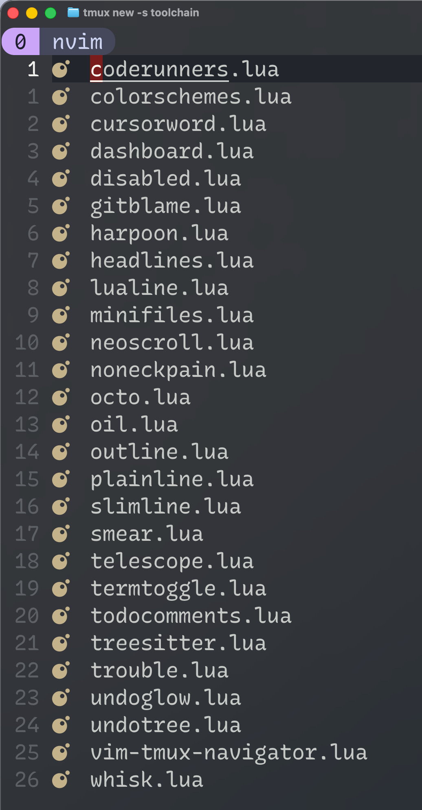
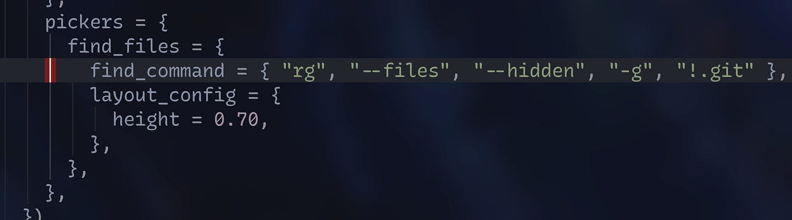

_Originally published on [my Substack](https://dasunpubudumal.substack.com/p/my-thoughts-on-using-neovim-for-programming) on 9 August 2026._

I have tried a few different code editors (text editors?) in the past few (6-7) years. I’ve used the [Jetbrains](https://www.jetbrains.com/ides/) IDEs, [Visual Studio Code](https://code.visualstudio.com/), and even the relatively older ones like [Eclipse](https://eclipseide.org/), [Netbeans](https://netbeans.apache.org/front/main/index.html) (these two were largely for Java development), [Atom](https://atom-editor.cc/) ([remember](https://github.blog/news-insights/product-news/sunsetting-atom/) Atom?), [Brackets](https://brackets.io/?lang=en), [Sublime](https://www.sublimetext.com/), and - when I was starting out programming - [Notepad++](https://notepad-plus-plus.org/) (which recently went through [a supply chain attack](https://www.rapid7.com/blog/post/tr-chrysalis-notepad-supply-chain-risk-next-steps/)). However, after the heavy AI-ification[^1] of code editors, I have decided that I need a more customisable code editor that I could properly decide how I configure it[^2].

On one of my regular trips to YouTube, [theprimeagen](https://www.youtube.com/@ThePrimeTimeagen) caught my attention - especially [this playlist](https://www.youtube.com/watch?v=X6AR2RMB5tE&list=PLm323Lc7iSW_wuxqmKx_xxNtJC_hJbQ7R) “Vim as your editor”. I really like to install stuff and try things out, so I had a go (this was about a year ago - maybe a year and a half). To be honest, I really liked how fast he typed (I am a fast typer myself), and better yet, how quickly he navigated between different places on the screen. It didn’t feel like magic, but I thought it was really cool. By this time, I didn’t understand how impactful it was; that was probably because I was mostly skimming through the videos and thinking how cool this guy was traversing between his code that fast[^3] using a split keyboard[^4]. So, my experiments with Vim dwindled as the time passed after I finished watching that series. By that time, I was using [RubyMine](https://www.jetbrains.com/ruby/) (for [Ruby on Rails](https://rubyonrails.org/)) and Visual Studio Code (for Python, [Rust](https://doc.rust-lang.org/book/) - and a bit of [Ansible](https://docs.ansible.com/)) so, I reverted back to my comfortable editors.

Some time after, I got involved in a [greenfield project](https://en.wikipedia.org/wiki/Greenfield_project) so, I was writing a _lot_ of code. One thing about writing a lot of new code is that it demands coordination between how fast you think and how fast you can get those thoughts into code.

> _“We Are Typists First, Programmers Second”_  
> \- [Coding Horror](https://blog.codinghorror.com/we-are-typists-first-programmers-second/) (Jeff Atwood; Co-Founder of Stackoverflow[^5])

I realised that I get really frustrated by typing mistakes and navigation mishaps; especially when I need time in between to go back and change something I’ve done in a code line. If that particular act takes a while, my train of thought could - and quite often, would - have already gone (I think this probably is my incapability to hold a thought for a while). So, I have to go back to my thoughts, synthesise them back; it takes a lot of duplicate cognitive effort. Some duplicates are necessary, but I figured that this case was not one of them. I think what _made_ me realise this was the fact that I watched that playlist (and some others; [teej_dv](https://www.youtube.com/c/tjdevries) is also a really good channel). If I hadn’t seen it, I probably wouldn’t have realised this[^6]. So, this was the point I decided to go back and _really_ see if Neovim could solve this issue.

## Modes and Motions

One of the very first things that I noticed was the concept of modes. In other editors, you are _always_ in an edit mode. But in Neovim (and in Vim[^7]), you have [many modes](https://neovim.io/doc/user/intro/#_modes%2c-introduction) that you explicitly need to get into (well, except the mode you start with, which is the Normal mode). I realise these modes as a separation between execution of commands, and insertion of text. I think most people are switching between three main modes: Normal (N), Visual (V) and Insert (I). This prevents from additional character inserts when you are navigating because navigation is separated to a different mode which you explicitly need to enter into (Normal mode; `Ctrl + C` or `Esc`).

Because Neovim is a fork of Vim, [Vim motions](https://www.barbarianmeetscoding.com/boost-your-coding-fu-with-vscode-and-vim/moving-blazingly-fast-with-the-core-vim-motions/) still apply to Neovim. I think the realisation of this this is the reason why I sticked to Neovim this time around (as I continue to explain through the article). Vim motions are essentially “cursor movements” that becomes a command when combined with an operation (e.g., yank, change, delete, etc). Most Vim motions are used to navigate or combine with operators to form commands, and this mainly happens in Normal mode and Visual mode. So, for example, if you want to delete the current word, the operation would be `d` (for delete), and the motion would be `w` (for word).

I’ve frequently found myself in an advantage using Neovim, rather than any other editor because of motions. I often run into scenarios where I need to jump between braces (using `%`), change what’s inside quotation marks (`ci"`) and _many_ other[^8] combinations that would require more keystrokes if I’m using default key-bindings in other code editors and - the worst of all - a few mouse movements. If you do this in a traditional code editor with default bindings, that would possibly involve multiple key strokes than the motions did.

### Mouse movements

I think I lost a lot of time when using other editors (well, their default key-bindings) when moving my mouse pointer. I think I have good gear: [MX Master 4](https://www.logitech.com/en-gb/shop/p/mx-master-4) with custom settings adjusted so I can move the cursor faster but still I realised that moving the mouse contributed to some sort of a context switch - it was minimal, but noticeable upon reflection.

Let’s say that you have to change what’s inside quotations; let’s say your code is `x := "neo vim"` for demonstration purposes, and assume the cursor is on `x`. Years of coding might have lead you to _feel_ that it’s really an atomic task; but actually it’s not. Let’s break it down:

1. First, you have to move your hand over to the mouse. If you’re already on the mouse, well, okay you don’t need to do this.
2. Then, you need to move your mouse pointer to where the string literal starts (`"`).
3. After, you have to highlight what’s inside the quotation marks.
4. Then, you enter the replacement text for the string literal without pressing delete.

The first two steps are actually optional; you can use the keyboard instead. So, this would mean pressing the up and/or down key a bunch of times. If you’re clever (and lucky) enough, you could probably `Cmd + F` and search for `"n` and press enter if the first match hits.

On Neovim, however, this is just one motion: `vi"`. No cursor movement, no highlights and definitely no mouse.

I realised that almost-omitting mouse from my code editing process actually saves a lot of time and context switching.

---

I think it’s helpful to re-map some keys of your keyboard as well. Moving into the Normal mode (which you will do a lot) can be done either via `Ctrl + c` or `Esc`. I prefer the `Esc` option but I have to move my finger quite a distance to get that button pressed. I was watching yet another YouTube channel (can’t remember which this time) the other day and figured out one of its tricks: mapping Caps lock key to `Esc`. Caps lock is literally something that I never use (I’m not an SQL dev!) so for me it serves no purpose but yet it is so close to my normal wrist position so I don’t have to move my fingers so much. I installed [Karabiner](https://karabiner-elements.pqrs.org/) and re-mapped the two keys and have never looked back since.

## Plugins, plugins and plugins

I think Neovim is so popular because of its plugin system created by its community. There are a large corpus of plugins created for almost anything. Here are the plugins that I have installed:

Okay so, this is not the complete list of plugins, which leads me to my next sub-topic: OOTB Neovim configurations that are available.

### Out-of-the-box Neovim configs

[LazyVim](https://www.lazyvim.org/) and [NvChad](https://nvchad.com/) are both pre-configured Neovim "distributions"; starter configs that turn plain Neovim into a fuller IDE-like setup, so you don't have to build everything from scratch. These include a set of plugins and keymaps already configured. I use LazyVim because that happened to be the best one for my taste (and the first one I encountered!).

I really recommend if someone is starting out Neovim, first start out with the vanilla version without OOTB configuration. I think that way, you can find out how the lua-based configuration binds everything together. Later, when you are fluent enough to organise your plugin systems, and use a different plugin manager like [Lazy](https://github.com/folke/lazy.nvim).

### No Sidebar

When I was watching theprimeagen’s channel, I was amazed how he worked without a sidebar that shows his working directory(ies). I was so programmed to the typical layout of the code editors that I almost took the sidebar as a static thing that couldn’t be removed. LazyVim, by default comes with a sidebar (which I believe is [nvim-tree.nvim](https://github.com/nvim-tree/nvim-tree.lua); or it might be something that’s part of [snacks.nvim](https://github.com/folke/snacks.nvim) - I can’t remember), but easily hideable (`e`). I have chosen to start Neovim with the sidebar hidden.

I was almost afraid to hide it but went with that decision anyway. But I feel like I made a good decision. I am now - it took some time - able to do my regular programming without looking at the sidebar. This actually makes me wonder why it existed in the first place. It was actually not useful when I was writing code. I have [oil.nvim](https://github.com/stevearc/oil.nvim) installed as a kind of a “replacement” for the built-in Neovim explorer [netrw](https://vonheikemen.github.io/devlog/tools/using-netrw-vim-builtin-file-explorer/) (which not a bad option) just because it treats the explorer as a buffer so I can just create, read, update and delete files as if I am interacting with a normal Vim buffer.

#### Telescope and Harpoon

Also, I think plugins like [Telescope.nvim](https://github.com/nvim-telescope/telescope.nvim) (which is built-in in LazyVim) - created by the YouTuber [teej_dv](https://www.youtube.com/@teej_dv), and [harpoon](https://github.com/theprimeagen/harpoon) - created by theprimeagen himself, makes stuff easier to not to have a sidebar. Telescope is a fuzzy-finding solution; I’ve mapped `ff` to open it along with a few [pickers](https://github.com/nvim-telescope/telescope.nvim#pickers) to hide some dotfiles that I don’t want to search (`.git` ones)

Harpoon lets you pin files. Say you’re working on writing a test in a test file to an existing function. You can either have a screen-split (I do this with tmux). Or, you can have the test file and the source file harpooned so you can switch between using the keys you’ve mapped.

---

There are a lot of other useful plugins that I won’t go into detail here. I think it’s trial and error mostly. It helps to check what the community is using and try them out as you go.

Here are some good resources (apart from the ones mentioned above):

1. [typecraft](https://www.youtube.com/@typecraft_dev)
2. [joseanmartinez](https://www.youtube.com/@joseanmartinez)
3. [codingwithsphere](https://www.youtube.com/@codingwithsphere)
4. [awesome-neovim](https://github.com/rockerBOO/awesome-neovim)
5. [vimcolorschemes](https://vimcolorschemes.com/i/trending)

## Adoption curve

I think Neovim loses a lot of users in the early stage of the adoption of the text editor. It’s a very different form of code editing compared to other editors. Its learning curve is not that steep, but it takes some getting used to.

My thought on this is that I think if you want to see how this code editor pays dividends, you need to make it your primary code editor and have all the other editors as secondary. The mistake that a lot I know make is that they make Neovim their secondary and still keep whatever else they use as the primary. I don’t think that lets you get in the way you want into Neovim. I am speaking from experience here: the more you stay in Neovim and the more mainstream work you do using Neovim, you would start to see the little things that it pays. After all, it is the accumulation of the small that makes a huge difference.

As I’m writing this article, I found myself pressing `k`s and `j`s, `de`s, `dB`s, and `{`s a few times. I think once you get past that “what is the point of all this” phase, you begin to realise that Neovim actually saves time here and there which totals up to a significant time, and the way you use it gets ingrained to you.

### Practising motions

I have heard that one of the best ways to learn motions is to install the Vim plugin in your code editor. I think it’s a good way to get started. But I guess if you really want to get into this, why not start with the code editor itself?

## Conclusion

Looking back, I don’t think Neovim actually made me a faster typist. What it did was shrink the gap between having a thought and getting it onto the screen; no mouse, no hunting, no losing my place while I go fix something three lines up. That gap is what Jeff Atwood’s quote was really about, and it’s the thing I didn’t fully appreciate when I first watched theprimeagen fly around his screen. I just thought it looked cool coding in his cool-looking code editor and his expensive keyboard[^9].

I don’t think Neovim is for everyone and everything, and I don’t think it needs to be. If your editor already lets your hands keep up with your head, you don’t _need_ this. But if you’ve ever felt that specific frustration; the one where you know exactly what you want to change, and the editor is the thing standing between you and doing it; it might be worth the few weeks of feeling “clumsy”.

I still press `k`s and `de`s by accident sometimes. I’ve stopped minding.

[^1]: I’m not anti-AI. I just don’t want my code editor to be AI-native. I think [this X post](https://x.com/sethrose/status/2076695003888308724) pretty much covers why.
[^2]: I’m not doing Java anymore. I think if you’re in Java, IntelliJ is still the way to go.
[^3]: I was fascinated by how he didn’t have a sidebar showing all the files which is typical for almost all the code editors. I have now realised that the sidebar is a waste of useful space.
[^4]: I wanted one (I still do). They are crazy expensive.
[^5]: Whatever happened to Stack Overflow? I loved that platform. Looks like [AI killed it](https://futurism.com/artificial-intelligence/ai-has-basically-killed-stack-overflow).
[^6]: Makes me think what else I am missing out on. I guess that’s life; you search, find and adopt.
[^7]: Neovim is actually a fork of the traditional unix Vim. Neovim has added features like lua-based config management, [LSP](https://microsoft.github.io/language-server-protocol/) support, etc.
[^8]: `f` and `t` (and their upper cased variants) are honourable mentions. I can’t possibly name all the motions.
[^9]: I think the keyboard also plays a part here. I’ve heard that split keyboards help with vim-based editors. But they are _so_ expensive so I have moved into a NuPhy keyboard with brown switches (which itself was expensive but not that much).

